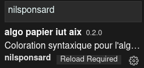

# Fonctionnalités 
 - coloration syntaxique
 - snippets

# Utilisation
les fonctionnalités seront activées automatiquement sur n'importe fichier avec l'extension `.algo`. Pour les autres noms de fichier il faut appuyer sur le texte à gauche de la cloche (souvent c'est écrit `Plain Text`) pour activer la coloration syntaxique sur le fichier en cour d'édition.
 
# installation
## Méthode 1
dans visual studio code faites ctrl+p puis tapez (ou collez) `ext install nilsponsard.algo-papier-iut-aix`.
une pression sur la touche entrer devrait installer l'extension
## Méthode 2
- cliquez sur le bouton  pour afficher le panneau des extensions.
- Ensuite cherchez `nilsponsard` dans la barre de recherche, un seul résultat devrait apparaître.  

- il suffit ensuite de cliquer sur `algo papier iut aix` puis sur le bouton  en vert 

